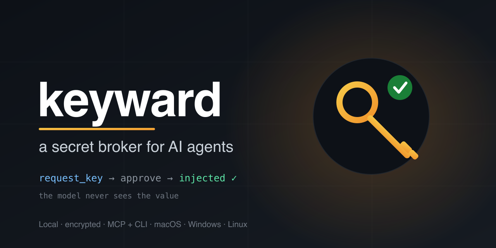

<p align="center">
  
</p>

<h1 align="center">keyward</h1>

<p align="center">
  <strong>Store your API keys once. Let any AI tool request them with your approval — without ever seeing the value.</strong>
</p>

<p align="center">
  <a href="https://github.com/arturayupov/keyward/actions"></a>
  
  
  
</p>

---

keyward is an open-source, local, encrypted **secret broker for AI coding agents**. Instead of pasting API keys into chat (where they leak into context and transcripts) or re-entering the same key in every new session, project, and IDE, you keep your keys in one encrypted vault. When Claude Code, Cursor, Gemini CLI, or any [MCP](https://modelcontextprotocol.io)-capable tool needs a key, it **requests it by name**, you **approve that single request** in a native OS prompt, and keyward **injects only that key** into your project. The model never receives the value.

## The problem

1. **Leaking keys into AI chat** — paste a key into a prompt and it lands in context, transcripts, and logs.
2. **Re-entry tax** — you type the same key again in every new session, project, IDE, and machine.
3. **Scattered `.env` files** — no single source of truth; you forget which key lives where.
4. **Zero control** — an agent can read or grab every secret at once instead of the one it needs.
5. **Tool lock-in friction** — switch IDE or model and you redo all key setup.

## How it works

```
AI tool ──request_key("STRIPE_KEY", project)──▶ keyward ──native approval──▶ you
                                                    │ approved
        ◀── "injected STRIPE_KEY → ./.env" ─────────┘   (value never shown to the model)
```

- **Vault** — an [age](https://age-encryption.org)-encrypted file (`~/.keyward/vault.age`, `0600`). The master key lives in the **OS keystore** (macOS Keychain / Windows Credential Manager / Linux libsecret), never on disk in plaintext.
- **Two faces** — an **MCP server** (`list_keys`, `request_key`) for AI tools, and a **`keyward` CLI** for everything else.
- **Out-of-band approval** — the approval dialog is fired by keyward itself, not rendered in the agent's stream, so the agent **cannot** auto-approve. Choose *Approve once*, *Approve for session*, or *Deny*.
- **Value-free by construction** — `list_keys` returns names only; `request_key` returns a confirmation; the audit log records the decision but never the value.

## Install

```bash
# Homebrew (macOS / Linux)
brew install arturayupov/tap/keyward

# Scoop (Windows)
scoop bucket add arturayupov https://github.com/arturayupov/scoop-bucket
scoop install keyward

# Go
go install github.com/arturayupov/keyward/cmd/keyward@latest
```

Pre-built binaries (macOS/Windows/Linux, amd64+arm64) are also attached to each [release](https://github.com/arturayupov/keyward/releases). See [INSTALL.md](INSTALL.md) for per-OS notes (incl. Linux libsecret) and [TROUBLESHOOTING.md](TROUBLESHOOTING.md) if something doesn't work.

## Quickstart

```bash
# 1. create the encrypted vault (master key goes into your OS keystore)
keyward init

# 2. import keys you already have scattered in .env files
keyward import ~/projects

# 3. point your AI tool at keyward's MCP server (see below), then just ask:
#    "use my STRIPE_KEY for this project" → approve the prompt → done
```

### Use it as an MCP server

keyward is a standard **stdio MCP server**, registered the same way as the
official MCP servers. Two steps:

**1. Install the binary** (once) — `go install` above, or Homebrew/Scoop (soon),
or a [release](https://github.com/arturayupov/keyward/releases) binary.

**2. Register it with your AI tool:**

```bash
# Claude Code — one command:
claude mcp add keyward -- keyward serve-mcp
```

Or add it to the config by hand (`~/.claude.json`, or a project `.mcp.json`):

```json
{ "mcpServers": { "keyward": { "command": "keyward", "args": ["serve-mcp"] } } }
```

Cursor, Windsurf, Cline, and other MCP clients use the same `command`/`args`
shape in their MCP settings. Restart the tool and ask it to use a key by name.

> **Why not "paste a repo URL"?** No MCP client auto-installs a server from a
> GitHub link — by design, clients won't run arbitrary remote code. keyward is
> also intentionally **local** (it needs your OS keystore and writes to your
> local files), so it isn't a remote/hosted URL server. The two steps above are
> the standard, secure install path. Full walkthrough in [USAGE.md](USAGE.md).

## CLI reference

| Command | Description |
|---|---|
| `keyward init` | Create the encrypted vault and master key |
| `keyward import [root]` | Import secrets from `.env` files under `root`, grouped by project |
| `keyward add NAME --ns NS` | Add/update one secret, value read from stdin (for non-`.env` creds) |
| `keyward ls [--ns NS]` | List key names and namespaces (**never values**) |
| `keyward inject NAME --ns NS --into PATH` | Inject one key into a target env file (prompts for approval) |
| `keyward serve-mcp` | Run the MCP server over stdio |

## Security model

- The secret **value is never returned to the AI agent** — `request_key` injects it into a target file and returns only a confirmation.
- The value is **never written to the audit log** (`~/.keyward/audit.jsonl` records tool, key, namespace, target, decision — no value) and **never printed** by `ls`/`inject`.
- Approval is **out-of-band**: a native OS dialog the agent cannot click. All dialog backends **fail closed** — any error or cancellation is a **Deny**.
- The vault is **encrypted at rest** with `age`; the master key lives in the OS keystore.

These invariants are enforced by automated tests. Details and threat model in [SECURITY.md](SECURITY.md).

## How it compares

| | keyward | envchain | pass / sops | 1Password CLI |
|---|---|---|---|---|
| Encrypted local store | ✅ | ✅ (Keychain) | ✅ | ✅ (cloud) |
| **Agent requests a key by name** | ✅ | ❌ | ❌ | ❌ |
| **Per-request human approval** | ✅ | ❌ | ❌ | ❌ |
| **Value never reaches the model** | ✅ | n/a | n/a | n/a |
| MCP server for AI tools | ✅ | ❌ | ❌ | ❌ |
| Open source | ✅ (MIT) | ✅ | ✅ | ❌ |

The encrypted-storage problem is solved; keyward adds the missing **agent-facing, approval-gated broker** on top. See [docs/comparisons](docs/comparisons/) for honest long-form comparisons (including when each alternative is the better choice).

## Roadmap

Full detail in [ROADMAP.md](ROADMAP.md). Highlights:

- **v0.2** — signed/notarized binaries (no keystore prompt), Homebrew/Scoop, biometric approval (Touch ID / Windows Hello), Windows ACL hardening.
- **v1.0** — tray/menubar app, per-key policy & allowlists, rotation reminders, `target: "env"` injection.
- **v2.0** — encrypted multi-device sync (user-owned backend), team mode.

## Contributing

Contributions welcome — see [CONTRIBUTING.md](CONTRIBUTING.md). Found a security issue? See [SECURITY.md](SECURITY.md) for responsible disclosure.

## License

[MIT](LICENSE) © 2026 Artur Ayupov
